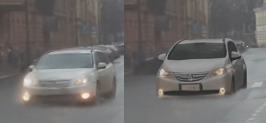
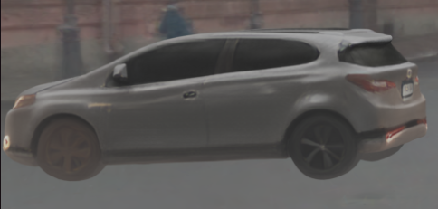
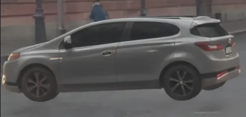

    <!-- project badges -->
    
    <!-- paper badges -->
    

<h4 align="center">R3D2: Realistic 3D Asset Insertion via Diffusion for Autonomous Driving Simulation</h4>

  

[Project page](https://research.zenseact.com/publications/R3D2/)  

# Unofficial reproduction of the paper
## 1. 3DGS render with naive assest extraction & insertation
Adjusted code of [Amodal3R](https://github.com/Xrenya/Amodal3R) can extract necessary data and scale the select asset to the target size of objects, also the rotation code is added so it is possible to adjust the corresponding angle within the scene.

The result of the object replacement with the 3DGS asset within the given scene:

  

## 2. Diffusion image render
Current result was obtained using [Difix](https://huggingface.co/spaces/nvidia/difix) which show that the current method does work but it still requires finetuning so obtain the better results (e.g. reflections/shadows should be added as well):

  
  

Also the car was successfully rotated 90 deg and insertated into the same scene and it still looks good.
